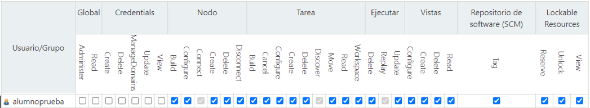

# jenkis_user_management
Scripts to bulk create/delete users in jenkins using the jenkins groovy API.

# Setup

1. Install Java (>= 11) python3 and pip.
2. Install python dependancies with "pip install -r requirements.txt".
3. Download the jenkins-cli.jar from your server (you can find it in "https://<your_jenkins_server>/jnlpJars/jenkins-cli.jar").
4. Create a .env file in the root folder of the project with the login information to your Jenkins server.

## .env file format

The .env file should contain three variables, the url of the Jenkins server, the username to do the login and the password. 
An example file is available below:

```
URL= # Url to the jenkins server
USER= # user name to login into the server
PWD= # password to login into the server
```

# Usage
Two bash scripts are available: **add_users.sh** and **clean_users.sh**. The former allows the bulk creation of users and the later the bulk deletion.

## add_users.sh 

```
add_users.sh users.csv
```

This script allows the bulk creation of a bunch of users from a .csv file. The .csv file must contain at least two columns **name** and **pwd**. 
The **name** column must contain an unique username and the **pwd** the password associated to the given user name. 
If a user does not exist in the Jenkins server, it is created, however, regardless of whether the user exists or not its permissions are reset to the default set of permissions.

The default set of permissions are the following:



## clean_users.sh

```
clean_users.sh [important_users.csv]
```

This script allows the bulk deletion of a bunch of users from a Jenkins server. By default all the users in the server are deleted, however, 
a **.csv file** can be passed with the name of the users that don't want to be deleted. The csv file must contain at least one column named **name** 
with the users to be ignored in the deletion process.

# Changin default permissions

The default permissions of each user are hardcoded into the **load_credentials.groovy** file. To change these permissions it is neccesary to change the **roles** variable at the
top of the script.


